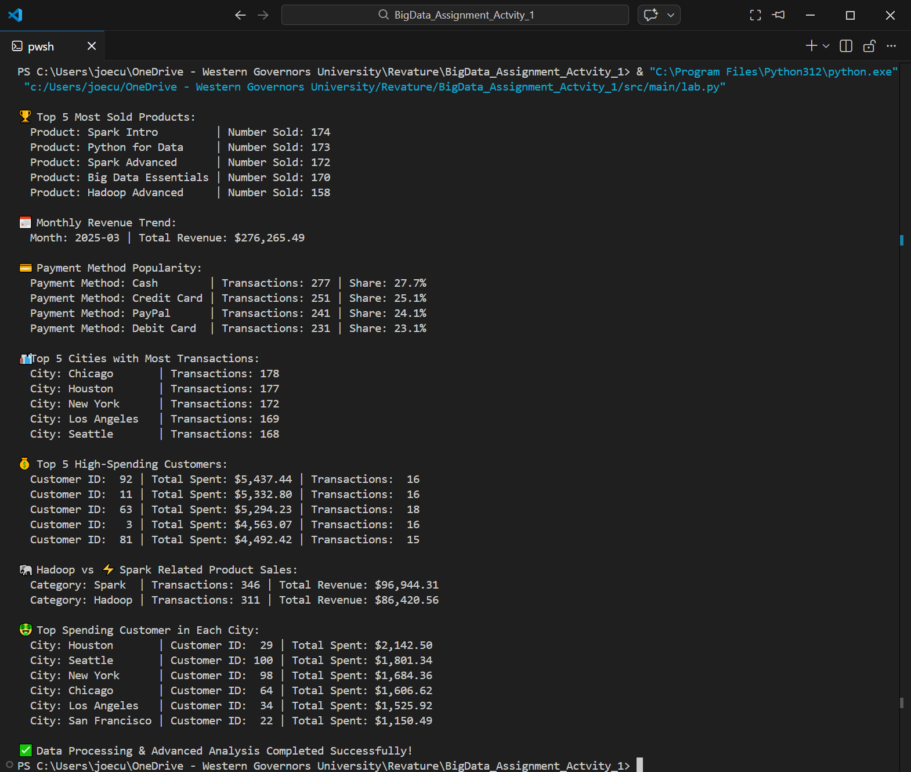

# 🏆 Student Lab: Transactions Data Processing

## Overview
This lab is designed to help you process CSV transactions using Python and SQL.

## Instructions
1. Clone the repository to your local system.
2. Install the required VS Code extensions by running the following in Windows Subsystem for Linux (WSL):
```bash
bash install-extensions.sh
```
4. Open the project in VS Code.
5. Implement your code inside `src/main/lab.py`.
6. Run your script and check the output.
7. Commit and push your changes to GitHub.

## Notes
- The `transactions.csv` dataset is provided inside the `src/data/` folder.
- The code should read the CSV file, perform basic analysis, and store data in an SQLite database.

Good luck! 🚀

## Rendered Output (terminal):
   
